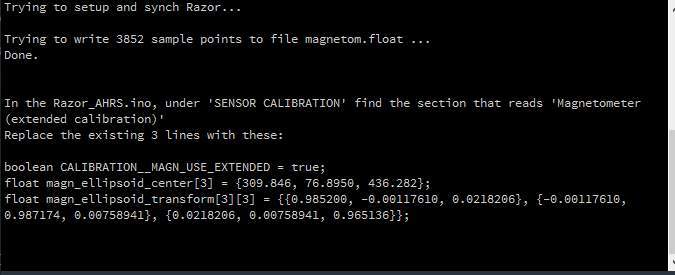

# SparkFun (PID 14001 9DoF Razor IMU M0) as an electronic compass.

The Sparkfun Razor IMU features:
  * MPU-9250 with three 3-axis sensors:
  * Accelerometer, gyroscope and magnetometer
  * Atmel SAMD21 cortex-M0+ 32-bit ARM micro controller (Arduino compatible with boot loader)
  * 9DoF (9 Degrees of Freedom) for multipurpose IMU (Inertial Measurement Unit)
  * Includes a microSD card socket, LiPo battery charger

As of this writing (10/15/2020) the product is no longer available from Sparkfun but can be still obtained from Amazon:
https://www.amazon.com/SparkFun-PID-14001-9DoF-Razor/dp/B01MXW00BY.

The code here is forked from  https://github.com/KristofRobot/razor_imu_9dof and is lightly rewritten to add outputting the magnetic heading data in SignalK form. The device is currently used by directly connecting to the SignalK RPi server via USB.

Install Arduino firmware
-------------------------
1) For SEN-14001 (9DoF Razor IMU M0), you will need to follow the same instructions as for the default firmware on https://learn.sparkfun.com/tutorials/9dof-razor-imu-m0-hookup-guide and use an updated version of SparkFun_MPU-9250-DMP_Arduino_Library from https://github.com/lebarsfa/SparkFun_MPU-9250-DMP_Arduino_Library (an updated version of the default firmware is also available on https://github.com/lebarsfa/9DOF_Razor_IMU). The lebarsfa library is obtained from github by adding it to lib_deps in the platformio.ini file.

2) Open `src/Razor_AHRS/Razor_AHRS.ino` in Arduino IDE. Note: this is a modified version
of Peter Bartz' original Arduino code (see https://github.com/ptrbrtz/razor-9dof-ahrs). 
Use the signalk branch of this repo.

3) Select your hardware here by uncommenting the correct line in `src/Razor_AHRS/Razor_AHRS.ino`, e.g.

<pre>
// HARDWARE OPTIONS
/*****************************************************************/
// Select your hardware here by uncommenting one line!
//#define HW__VERSION_CODE 10125 // SparkFun "9DOF Razor IMU" version "SEN-10125" (HMC5843 magnetometer)
//#define HW__VERSION_CODE 10736 // SparkFun "9DOF Razor IMU" version "SEN-10736" (HMC5883L magnetometer)
#define HW__VERSION_CODE 14001 // SparkFun "9DoF Razor IMU M0" version "SEN-14001"
//#define HW__VERSION_CODE 10183 // SparkFun "9DOF Sensor Stick" version "SEN-10183" (HMC5843 magnetometer)
//#define HW__VERSION_CODE 10321 // SparkFun "9DOF Sensor Stick" version "SEN-10321" (HMC5843 magnetometer)
//#define HW__VERSION_CODE 10724 // SparkFun "9DOF Sensor Stick" version "SEN-10724" (HMC5883L magnetometer)
</pre>

4) Upload Arduino sketch to the Sparkfun 9DOF Razor IMU board

Razor operation and output
---------

Whe the device starts up, it is in SignalK mode, outputting the yaw as the magnetic heading.

  <pre>
  {"context": "vessels.self" , "updates" : [{ "values" : [{"path" : "navigation.headingMagnetic" , "value" :-0.619}], "source": { "label" : "Razor.IMU"}}]}
  {"context": "vessels.self" , "updates" : [{ "values" : [{"path" : "navigation.headingMagnetic" , "value" :-0.619}], "source": { "label" : "Razor.IMU"}}]}
  {"context": "vessels.self" , "updates" : [{ "values" : [{"path" : "navigation.headingMagnetic" , "value" :-0.619}], "source": { "label" : "Razor.IMU"}}]}
  .
  .
  .
</pre>

If you click in the VSCode Terminal window and type `#ot` you will get the output in Yaw, Pitch, Roll (YPR) form.

  <pre>
  #YPR=-35.17,-18.06,-157.33
  #YPR=-35.18,-18.04,-157.32
  #YPR=-35.15,-18.09,-157.34
  .
  .
  .
</pre>

There are a number of other commands than can be used which are documented in the file Razor_AHRS.ino

IMU Calibration
---------
Calibration of the accelerometer and gyro is not necessary but it is important to perform a calibration of the magnetomoter. This should be done in the location where the device is to be installed. In order to dperform the calibration, you will need to install Processing https://processing.org. The Processing sketch that has been written for the calibration works for Processing Ver 2.2.1. I do not know about other versions.

After installing Processing, navigate to `/Processing/Magnetometer_calibration` and execute the file `Magnetometer_calibration.pde`. This will open a Processing Sketch editor window. There are instructions in the `pde` file for loading the EJML library. This requirement has been satisfied by the placement of `EJML.jar` in the `code` folder.

 It will be necessary for you to specify the serial port that your device is connected to. Start the Magnetometer_calibration sketch by clicking on the Run button at the upper left hand corner of Processing window. 

  
 

In the output portion of the Processing window, it will list the available serial ports. Here, I am using COM17 which is port 3. Scroll down the Processing sketch to find the line that specifies the `SERIAL_PORT_NUMBER` and enter the correct port number. Then restart the sketch.

Now the object is to turn the Razor in all directions to try to uniformly fill the surface of a sphere. The center of the sphere will be displaced from the drawing if the local environment is distorted.

  

When you are satisfied with the result, you press space to output the calibration data and parameters. At the bottom of the Processing window, you get:

  

Follow the instructions to enter the magnetometer calibration parameters into the code.

You can see a fuller description of the magnetometer calibration at https://github.com/Razor-AHRS/razor-9dof-ahrs/wiki/Tutorial.

Compass Calibration
---------

The 9DoF Razor IMU was mounted so that changes to the vessel heading corresponded to changes to Yaw. On a relatively calm day the vessel was motored over a circular course, stabilizing on a course every 45 deg. The Ratheon ST6000 fluxgate compass reading and Yaw reading were recorded as a calibration.  The SignalK Calibraiton plugin was used to translate the raw 9DoF Razor IMU readings to the compass headings as given by the fluxgate compass. This calibration was performed 9/7/20.

The 9DoF Razor calibration was checked on 10/14/20 by motoring a circular course once again, incrementing the autopilot in 10 deg steps and allowing the boat to stabilize on course before recording the fluxgate compass and 9DoF Razor readings. The results are shown below.

  

I doubt that you can do much better than this. The scatter in the data is, I believe, indicative of wandering of the boat heading over short periods of time and reflective of the different setting times of the two compasses. 
